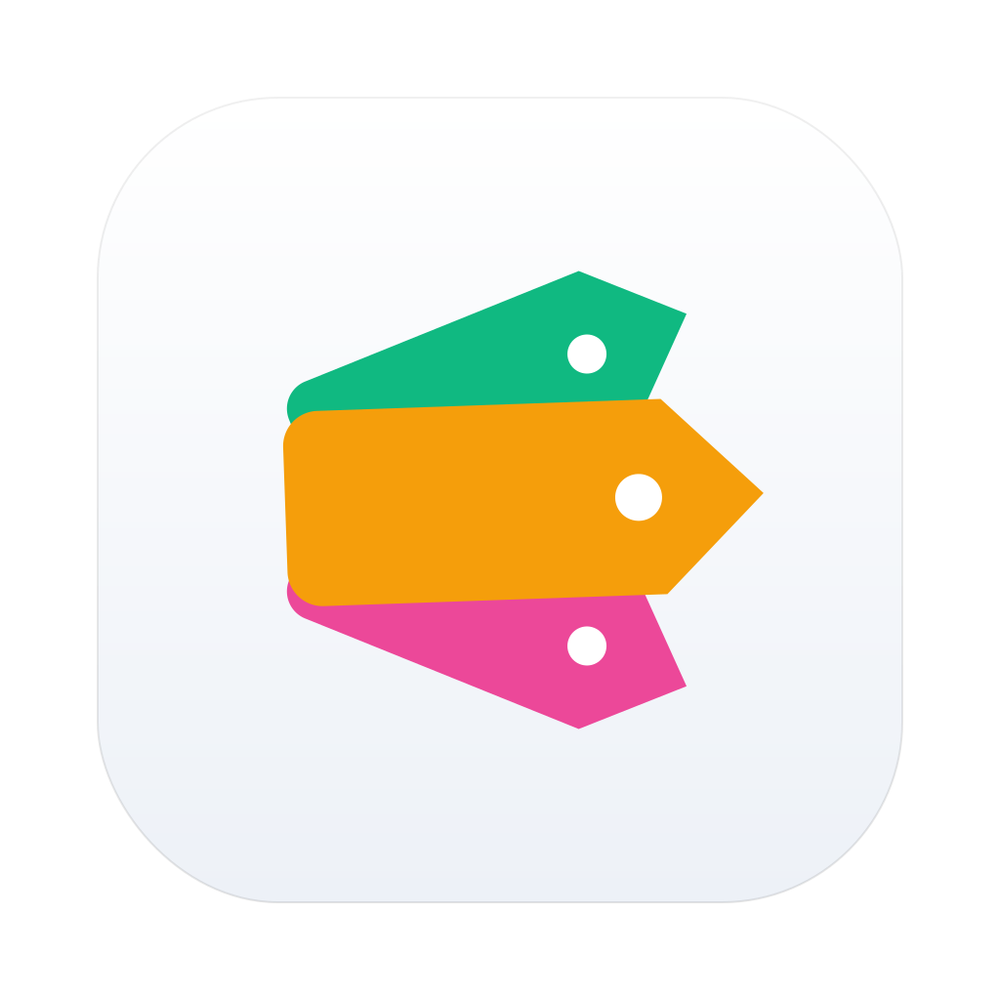

# FileLens

A non-destructive view layer for any folder on macOS. FileLens watches folders you choose and presents files grouped by user-defined tags — without ever moving, renaming, or modifying the original files.

> Files stay where they are. FileLens just shows them through a different lens.



## Why

Your `~/Downloads` (or `~/Desktop`, or any other dumping-ground folder) accumulates hundreds of files you never sort. Existing tools either physically move files (Hazel, Spotless — risky if a rule misfires) or are too weak (Finder Smart Folders).

FileLens fills the middle. You point it at a folder; it tags every file by type/name/age according to rules you control, and gives you a Finder-like sidebar to slice the contents by tag. Original files are never touched.

## Features

- **Multi-folder workspaces** — watch any number of folders, each with its own rule set
- **13 built-in tag rules** out of the box: Installers, Images, Videos, Audio, PDF, Documents, Archives, Code, Screenshots, Large files, New arrivals, Stale, Downloading
- **Custom rules** with extension / name / size / date / kind conditions, all/any combinator
- **Manual tags** — right-click any file to add an ad-hoc tag
- **Three view modes** with Finder-aligned shortcuts: icon (⌘1) / list (⌘2) / gallery (⌘4)
- **List view groups by date**: Today / Past 3 / 7 / 15 days / Past Month / 3 / 6 mo / Year / Earlier
- **Native interactions**: Quick Look (Space), Reveal in Finder (⌘R), Move to Trash (⌘⌫), Open (⌘↩), drag-out to other apps
- **Inspector pane** (⌘I) with metadata + tags
- **Search** (⌘F) over file names
- **System file icons** everywhere — same look as Finder
- **Live FSEvents-driven updates** — new downloads appear instantly with the right tags
- **English + 简体中文** localization

**Non-destructive guarantee:** the only physical action FileLens ever takes is "Move to Trash" (explicit user click). Files are never moved, renamed, copied, or modified by any rule.

## Install

Download the latest release from the [Releases page](https://github.com/lifedever/file-lens/releases/latest):

| Mac | Download |
|---|---|
| Apple Silicon (M1/M2/M3/M4) | `FileLens-X.Y.Z-arm64.dmg` |
| Intel | `FileLens-X.Y.Z-x86_64.dmg` |

Open the DMG and drag FileLens.app into `/Applications`.

**First launch (Gatekeeper):** because the app is dev-signed (ad-hoc), macOS will refuse to open it the first time. Open Terminal and run:

```bash
sudo xattr -rd com.apple.quarantine /Applications/FileLens.app
```

Then launch from Launchpad.

## Build from source

Requirements: macOS 14+ (Sonoma), Xcode 15+, [xcodegen](https://github.com/yonaskolb/XcodeGen) (`brew install xcodegen`).

```bash
git clone https://github.com/lifedever/file-lens.git
cd file-lens

# Generate FileLens.xcodeproj from project.yml:
xcodegen generate

# Run Debug build:
./Scripts/dev.sh

# Build a Release DMG (default arm64):
./Scripts/release.sh 0.1.0

# Or a specific arch:
./Scripts/release.sh 0.1.0 arm64
./Scripts/release.sh 0.1.0 x86_64
./Scripts/release.sh 0.1.0 universal
```

## Tech stack

- macOS 14+ · SwiftUI + AppKit
- SwiftData (persistence — strict per-bundle-ID store path)
- QuickLookThumbnailing
- FSEvents
- Direct DMG distribution, ad-hoc signing, not sandboxed

## Project layout

```
project.yml                             # source of truth for FileLens.xcodeproj (xcodegen)
FileLens/
├── FileLensApp.swift                   # @main + ModelContainer
├── Models/                             # SwiftData entities (Workspace, Rule, Condition, FileNode, FileTag)
├── Services/                           # RuleEngine, ConditionEvaluator, FolderWatcher, FileIndexer,
│                                       #   ThumbnailService, BookmarkStore, TagDisplay, KindDisplay,
│                                       #   DateBucket, BuiltInRules, StoreMigration
├── Views/                              # SwiftUI views
└── Resources/Localizable.xcstrings     # en + zh-Hans
FileLensTests/                          # XCTest (RuleEngine / ConditionEvaluator / BuiltInRules /
                                        #   FileIndexer / BookmarkStore / KindClassifier / StoreMigration)
Scripts/                                # dev.sh, release.sh
docs/superpowers/specs/                 # design spec
docs/superpowers/plans/                 # implementation plan
```

## License

MIT — see [LICENSE](LICENSE).
