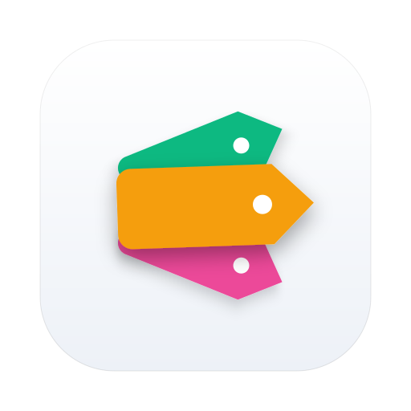
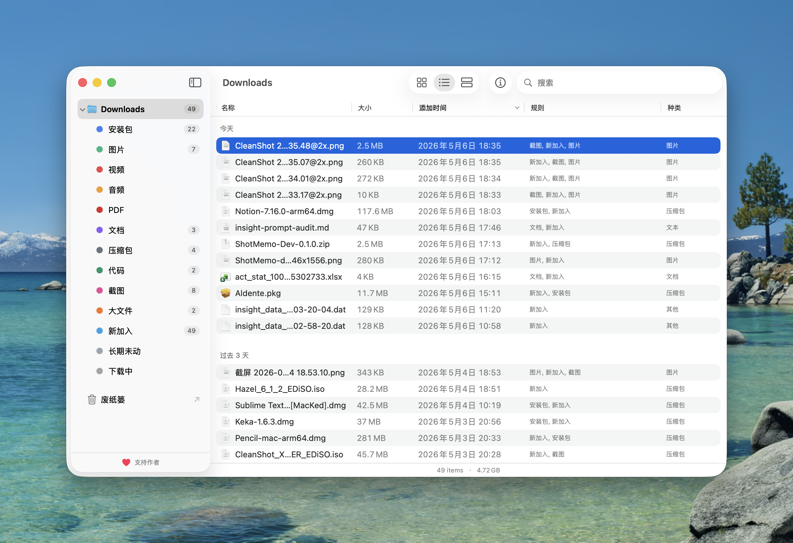

# FileLens

<div align="center">



### FileLens

**只看不动你的文件。**
给 macOS 任意文件夹加一层标签分组视图，原文件始终保持原位。


[⬇ **下载最新版**](https://github.com/lifedever/file-lens/releases/latest) | [💖 **赞助**](https://www.lifedever.com)

[English](README.md)

---

</div>

## FileLens 是什么？

你的 `~/Downloads` 里堆了几百个 `.dmg`、截图、PDF——一直没整理。市面上的工具要么是物理搬运型（Hazel，规则一错就翻车），要么太弱（Finder 智能文件夹只能搜，不能成体系地分组）。

**FileLens 不搬文件，只在 App 里给每个文件打上标签，按你想要的维度（类型 / 文件名 / 大小 / 时间）分组展示。** 原文件始终在原文件夹，不会被移动、重命名或修改。FileLens 唯一会动文件的物理操作就是"移到废纸篓"——而且只在你主动点击的时候。

<p align="center">
  
</p>

## 功能特性

- 🏷 **自动打标签** —— 13 条内置规则（安装包 / 图片 / 截图 / 大文件 / 长期未动……）+ 自定义规则
- 📁 **多工作区** —— 监听任意多个文件夹，每个工作区有独立规则集
- ⚡ **FSEvents 实时更新** —— 新下载的文件立刻出现并自动打标签
- 🔍 **三种视图** —— 图标（⌘1）、列表（⌘2，按时间自动分组）、画廊（⌘4）
- 👁 **原生交互** —— 快速预览（Space）、拖出、在 Finder 中显示（⌘R）、移到废纸篓（⌘⌫）
- 🎨 **原生 macOS 体验** —— 系统文件图标、与 Finder 对齐的快捷键、浅色 / 深色 / 跟随系统
- 🌐 **中英双语**开箱即用
- 🛡 **非破坏性承诺** —— 任何规则都不会移动、重命名、修改你的文件

## 安装

[**↓ 下载最新版 DMG**](https://github.com/lifedever/file-lens/releases/latest)

| Mac | 下载文件 |
|---|---|
| Apple Silicon（M1/M2/M3/M4） | `FileLens-X.Y.Z-arm64.dmg` |
| Intel | `FileLens-X.Y.Z-x86_64.dmg` |

把 `FileLens.app` 拖进 `/Applications`。因为是 ad-hoc 开发签名，首次打开 macOS 可能提示"应用已损坏"。一次性修复：

```bash
sudo xattr -rd com.apple.quarantine /Applications/FileLens.app
```

之后从启动台正常打开即可。

## 快捷键

| 操作 | 快捷键 |
|---|---|
| 快速预览 | `Space` |
| 用默认 App 打开 | `⌘↩` |
| 在 Finder 中显示 | `⌘R` |
| 移到废纸篓 | `⌘⌫` |
| 切换详情栏 | `⌘I` |
| 搜索 | `⌘F` |
| 切换视图（图标 / 列表 / 画廊） | `⌘1` / `⌘2` / `⌘4` |
| 设置 | `⌘,` |

## 自己编译

环境：macOS 14+、Xcode 15+、[xcodegen](https://github.com/yonaskolb/XcodeGen)、[librsvg](https://gitlab.gnome.org/GNOME/librsvg)。

```bash
brew install xcodegen librsvg
git clone https://github.com/lifedever/file-lens.git
cd file-lens
xcodegen generate
./Scripts/dev.sh                       # Debug 编译并打开
./Scripts/release.sh 0.1.0 arm64       # 打 Release DMG（或 x86_64 / universal）
```

## 技术栈

macOS 14+ · SwiftUI + AppKit · SwiftData · QuickLookThumbnailing · FSEvents

## License

[MIT](LICENSE) © lifedever

---

## ☕ 捐助

如果 FileLens 帮你省了时间，欢迎请我喝杯咖啡支持继续迭代：

- **赞助 / 捐赠**：<https://www.lifedever.com>
- **支付宝 / 微信**：见仓库主页二维码

或者直接给仓库点一个 ⭐ ，对独立开发者也是巨大的鼓励。
